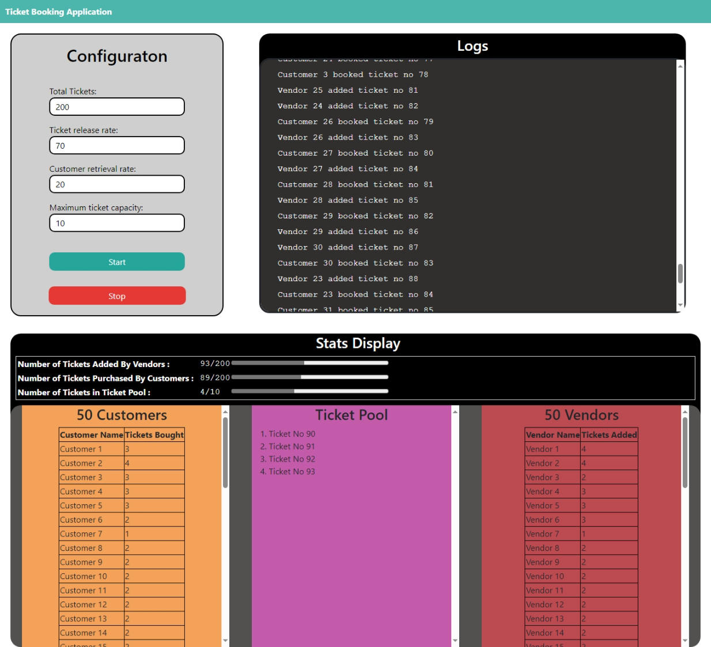

# Ticket Booking Simulator

## Introduction

This Ticket Booking Simulator is a multi-threaded Application that simulates a real-time ticket booking application with multiple vendor threads adding tickets and customer threads buying tickets.

## Setup Instructions

### 1. Prerequisits

- `Java 17` or later.

- `npm - version 10.9.0` or later.

- A Modern Browser (Eg: `Google Chrome`, `Microsoft Edge` etc.)

- `Node JS - v22.11.0` or later

- `Intellij IDEA IDE`

### 2. How to run the application

clone the Repo with github repository using the following commands if you have git on your pc.

    git clone https://github.com/vethumIIT/Tickets-Booking-Simulator.git
    cd ticket-booking-simulator

Otherwise you can directly download the Zip Folder and extract it to your preferred file location.

To use this application you have 2 options

1. Run the **Web Application**. For this you need to run the `Spring Boot` application and the `React` Application. You can use this method for a better user experience. with real time statistics and beautiful user interface.
2. Run the **CLI (Command Line Interface)** application to take your inputs and run the application that way.

### 1. Web Application

#### 1. Get the Backend Running (`Spring Boot`)

1. Step 1 Go to the following folder.`<Your-Project-file-Location>\Tickets-Booking-Simulator\BACKEND`

2. Step 2: Open the relavent program in `Intellij IDEA`.

3. Step 3: In `Intellij IDEA` and locate the file `<Your-Project-file-Location>\Tickets-Booking-Simulator\BACKEND\ticket-booking-simulator\src\main\java\com\app\ticket_booking_simulator\TicketBookingSimApp.java` and run that file.

4. Now you have the backend running.

#### 2. Get the Frontend Running (`ReactJS`)

1. **Step 1**: Go to the following folder.`<Your-Project-file-Location>\Tickets-Booking-Simulator\FRONTEND\ticketing-application`

2. **Step 2**: Open `Command Prompt` in the relavent folder

3. **Step 3**: Type the command `npm install` to install the dependencies.

4. **Step 4**: Now type the command `npm run dev`, and the react app will start running.

5. Now you have the frontend running. To access it  open your browser and enter `http://localhost:5173/` in your address bar.

### 2. CLI (Option)

1. Step 1 Go to the following folder.`<Your-Project-file-Location>\Tickets-Booking-Simulator\BACKEND`

2. Step 2: Open the relavent program in `Intellij IDEA`.

3. Step 3: In `Intellij IDEA` and locate the file `<Your-Project-file-Location>\Tickets-Booking-Simulator\BACKEND\ticket-booking-simulator\src\main\java\com\app\ticket_booking_simulator\TicketingApplicationCLI.java` and run that file.

## How to use the application

After Setting Up the Application you can start using the application.

When you start either the CLI application or the Web Application. You will be prompted 4 values. Below are what those values mean.

1. **`Total Tickets`** - This is the total number of tickets that will be added to the ticket pool by the vendors.
2. **`Ticket Release Rate`** - This value represents the number of tickets released by a single vendor per second.
3. **`Customer Retrieval Rate`** - This value represents the number of tickets each customer tries to buy per second.
4. **`Maximum Ticket Capacity`** - This is the maximum number of tickets that can be in the ticket pool at a given time. when this number is reached, the ticket pool will not allow vendors to add their tickets until a customer purchases a ticket and reduces the ticket count.

### 1. CLI Option

When you run the CLI, you will be prompted to enter the above mentioned values as shown bellow.

    Enter total tickets: 100
    Enter ticket release rate: 20
    Enter customer retrieval rate: 10
    Enter maximum ticket capacity: 30

Once you enter the final value, the simulation will start running and the logs of the program will be displayed.

    Enter total tickets: 100
    Enter ticket release rate: 20
    Enter customer retrieval rate: 10
    Enter maximum ticket capacity: 30
    Database Opened successfully!
    Table Created Successfully!
    Vendors Started
    Vendor 7 added ticket no 1
    Customer 6 booked ticket no 1
    Vendor 6 added ticket no 2
    Customer 5 booked ticket no 2
    Vendor 5 added ticket no 3
    Customer 4 booked ticket no 3
    Vendor 4 added ticket no 4
    Customer 3 booked ticket no 4
    ...

Once the Simulation ends the following information will be displayed on the screen.

    ...
    Total Ticket Count Reached! no more tickets can be added.
    Tickets in ticket pool: 0
    Added Tickets Count: 100
    Booked tickets count: 100

### 2. Web Application

Once you have the `React` Application and the `Spring Boot` application running, open your browser and go to `http://localhost:5173/`.

After the page loads you will be shown the main page for the Web Application shown below.
(***Note**: The following screenshot is a full page screenshot. Only half of the page can be seen at once in the actual Page*)

*Figure 1: Screenshot of the Dahsboard of the Web Application*

The **Configuration** panel has 4 number inputs that will allow you to enter the 4 configurable values for the simulation.

Below them are the start and stop buttons that allow you to start the simulation and stop the simulation.

Towards the right of the configuration panel is the **log display**. This shows you the simulation logs you would see the live logs you would see when you run the CLI, and will display logs in real time.

Below both of these is the *Stats* Pannel, which shows you the live statistics and graphics used to represent the simulation process.

At the top of this section you will see 3 values displaying,

1. The number of tickets added by the vendors, out of the `total tickets`.

2. The number of tickets purchased by the customers, out of the `total tickets`.

3. The number of tickets that are currently in the ticket pool out of the `maximum ticket capacity`.

Below this you can see 3 tabs labeled Customers, Ticket Pool and Vendors.

The Customers tab displays each cusomer and how many tickets each of them has bought in real time.

The Ticket Pool tab shows the tickets with their ticket number as they enter and exit the ticket pool in real time.

The Vendors tab shows displays each vendor and how many tickets they have added to the Ticket Pool in real time.

## Data Files

The data files are located in the `<Your-Project-file-Location>\Tickets-Booking-Simulator\BACKEND/ticket-booking-simulator/DataFiles` folder. Described below are the files in the DataFiles folder and what data they have.

1. **`Logs.txt`**: This file contains the logs for the last simulation you ran on either the CLI or the Web Application.

2. **`configs.txt`**: This file contains the 4 configuration values in json format for the last run simulation.

3. **`database.db`**: This database file contains the SQLite database containing informaion about all the tickets that were added to the ticket pool in the last simulation run. This database stores information of each ticket such as the ticket id, vendor id, customer id and whether the ticket was booked or not.

*Note that the DataFiles folder will be empty when you first download the project files, and will only be available after you run the first simulation.*
